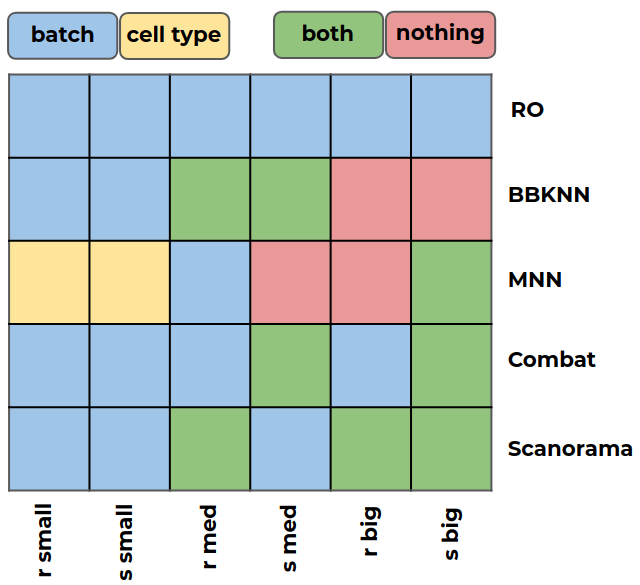
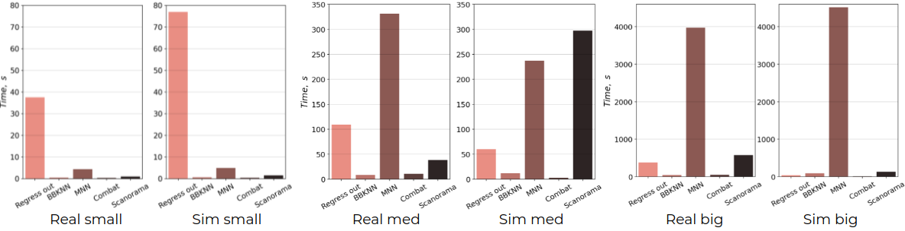
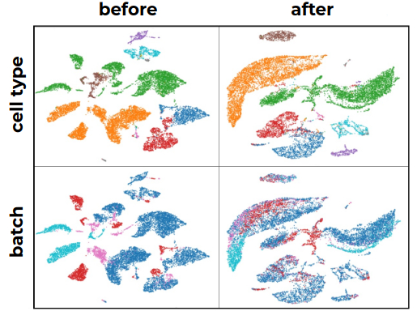

# Developing best practices for single-cell analysis: data integration

## Intoduction

Single-cell sequencing is paving the way for precision medicine. It is the next srep towards making precision medicine more accurate. However, the analysis of single-cell data is incredibly complex with numerous distinct approaches resulting in more than 500 Python and R libraries existing today.

## Project goals and objectives

The goal of this project is to tackle the complexity of data analysis by identifying the best approaches. The single-cell transcriptomics analysis has multiple steps, but we have focused on data integration &mdash; a crucial step when working with clinical data coming from patients.

## Objectives

1. Single-cell sequencing data search and preprocessing
2. Selection of metric to compare performance of different algorithms
3. Simulation of artificial scRNA-seq datasets to compare the performances of the algorithms on real data and similar simulated
4. Comparative analysis of algorithms aimed at batch correction in single-cell sequencing data
5. Create a tool based on existing algorithms for data integration

## Materials and methods

1. We found 3 public datasets approximately 500, 15000, 80000 cells and 2, 4, 2 batches respectively. It may be found [here](https://hub.docker.com/r/jinmiaochenlab/batch-effect-removal-benchmarking). Also you need docker to be installed on your computer.

2. Silhouette-score with cosine distance was chosen as a metric. If we denote through a &mdash; the average distance from this object to objects from the same cluster, through b &mdash; the average distance from this object to objects from the nearest cluster (different from the one in which the object itself lies). In our case labels of clusters are *cell type* or *batch*. Then the silhouette of this object is called the value:

$${\displaystyle s ={\frac {b-a}{\max\{a,b\}}}}$$

3. Generated 3 artificial datasets 500, 15000, 80000 cells and 2, 5, 2 batches respectively. **НАПИСАТЬ ПРО ЛИБУ И СКРИПТ!!!**

4. For the downstream work we have chosen 5 different approaches: [Combat]() and [Regress out]() which use linear models for batch correction and [MNN](), [BBKNN]() and [Scanorama]() which in turn are looking for mutual nearest neighbors in others batches for every cell.

5. Based on these 5 libraries, we made a program that for each specific dataset can choose the best approach and apply it to correct the batch effect.

## Results

We analyzed 5 algorithms on 6 datasets (3 real and 3 simulated). We provided batch correction of expression matrix, then calculated silhouettes for each cell in data and finally run MU-test to compare silhouettes of baseline (data before correction) and corrected data. We did it in two ways:
1. Calculate silhouettes based on *cell type* labels and then run MU-test with *alternative* argument equal "less", because in this situation correction should increase our metric (cell types must form separate clusters)
2. Calculate silhouettes based on *batch* labels and then run MU-test with *alternative* argument equal "greater", because in this situation correction should decrease our metric (different batches should mix)

Figure 1 shows the results obtained. Blue color means that the silhouette according to the batch is significantly reduced after correction, and yellow, that the silhouette according to the cell type is significantly increased.

<p align="center" width="100%">
     
</p>
<p>
    <em>Fig. 1. Significance of differences between silhouettes.</em>
</p>

Also in Figure 2 you can see the time it took for each algorithm to work on the corresponding data. It is expected that MNN based on the search for mutual nearest neighbors worked most often longer, but at the same time its modifications (BBKNN and Scanorama), which preliminarily reduce the dimension of the data using canonical correlation analysis worked much faster.

<p align="center" width="100%">
     
</p>
<p>
    <em>Fig. 2. Time performance of different algorithms on different datasets.</em>
</p>

Figure 3 depicts 

<p align="center" width="100%">
    
</p>
<p>
    <em>Fig. 3. UMAP before and after correction with Scanorama, labeled by cell type and batch.</em>
</p>


## Usage

```bash
git clone https://github.com/immunomind/bi2021spring.git
git checkout dev
cd bi2021spring/source
```

```bash
python data_integrator.py --adata ../example_data/example.h5ad \
                          --celltype celltype batch \
                          --batch batch \
                          --do_filter True \
                          --algtorun all \
                          --out example_result
```